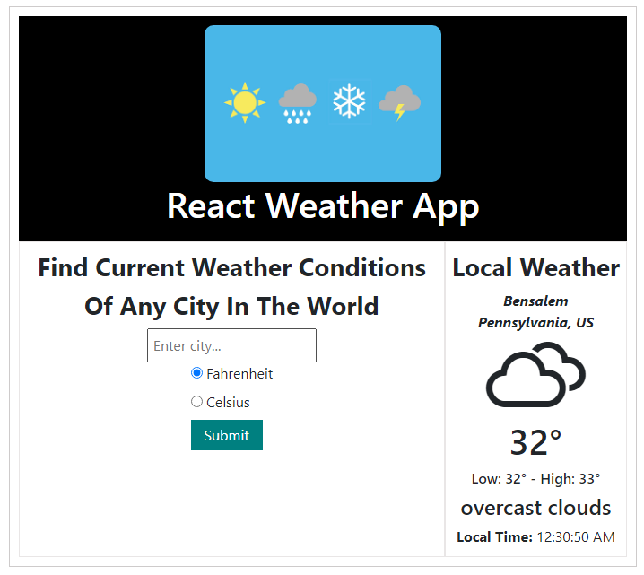

## Weather App React

This project is deployed to Surge.sh [Click here to open Weather App](http://smelly-growth.surge.sh/).

### Kelvin to Fahrenheit

F = (K - 273.15)\*9/5 + 32

### Kelvin to Celsius

C = K - 273.15

### Retrieve data from weather api specific to each city

http://api.openweathermap.org/data/2.5/weather?q={CITY_NAME}&appid={YOUR_API_KEY}

### To check the current location (city) of the user (don't forgot to put your own API_KEY at the end)

axios.get("https://extreme-ip-lookup.com/json/?key={API_KEY}")
.then(data => console.log(data))

Sample Output

